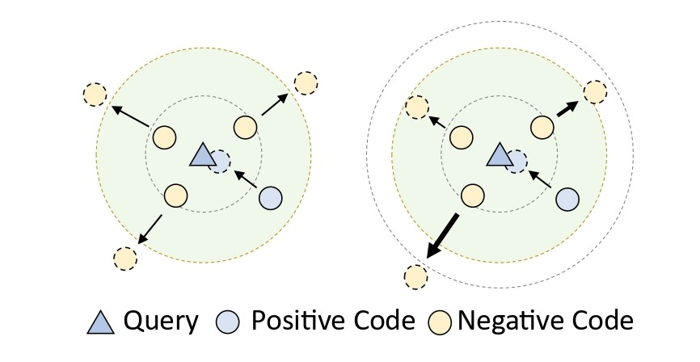

## Rethinking Negative Pairs in Code Search

This repo contains code for Rethinking Negative Pairs in Code Search, accepted to EMNLP 2023. 
In this codebase we provide instructions for reproducing our results from the paper. 
We hope that this work can be useful for future research on contrastive learning of code search.

## Motivation



Contrastive learning pushes away negative pairs in the representation space. 

**Left**: Existing works treat negative pairs equally. 

**Right**: Negative pairs should be pushed away according to their similarity with the query. 

A thicker arrow means that this sample is more negative than others.

## Environment

```
conda create -n softinfonce python=3.6 -y
conda activate softinfonce
conda install pytorch-gpu=1.7.1 -y
pip install transformers==4.18.0 scikit-learn nltk==3.6.1 tensorboardX tqdm more_itertools pytrec_eval elasticsearch tree_sitter
```

## Data
 
We follow the preprocessing rule described in [GraphCodeBERT](https://github.com/microsoft/CodeBERT/tree/master/GraphCodeBERT/codesearch).
Since our codes are developed based on that repo, you could follow the instructions described in 
[./GraphCodeBERT/README.md](#./GraphCodeBERT/README.md).


## Preparation
In the paper we mention three approaches to estimate the weight term, BM25, SimCSE, and trained models.
For BM25, it is a built-in function. However, for learning-based SimCSE and trained models, you need to train them first.

### SimCSE
To train the unsupervised SimCSE, run:
```angular2html
python nl_simcse.py \
--output_dir ./saved_models/SimCSE \
--root_path ./data/ \
--train_batch_size 256 \
--num_train_epochs 10  \
```

### Trained Models
#### CodeBERT
To train the CodeBERT with InfoNCE loss, run:
```angular2html
lang=python
save_dir=trained-codebert-${lang}
python run_siamese_test.py \
--model_type roberta \
--do_train \
--do_eval \
--evaluate_during_training \
--eval_all_checkpoints \
--data_dir ./data/ \
--train_data_file train.jsonl \
--code_type code \
--max_seq_length 200 \
--per_gpu_train_batch_size 32 \
--per_gpu_retrieval_batch_size 100 \
--learning_rate 1e-6 \
--num_train_epochs 10 \
--gradient_accumulation_steps 1 \
--output_dir ./model/${save_dir} \
--encoder_name_or_path microsoft/codebert-base \
--lang ${lang} \
--infonce
```

#### GraphCodeBERT
To train the GraphCodeBERT with InfoNCE loss, run:
```angular2html
lang=python
save_dir=trained-graphcodebert-${lang}
python run.py \
--output_dir=./saved_models/${save_dir} \
--config_name=microsoft/graphcodebert-base \
--model_name_or_path=microsoft/graphcodebert-base \
--tokenizer_name=microsoft/graphcodebert-base \
--lang=${lang} \
--do_train \
--do_eval \
--train_data_file=./data/${lang}/train.jsonl \
--eval_data_file=./data/${lang}/valid.jsonl \
--test_data_file=./data/${lang}/test.jsonl \
--codebase_file=./data/${lang}/codebase.jsonl \
--num_train_epochs 30 \
--code_length 256 \
--data_flow_length 64 \
--nl_length 128 \
--train_batch_size 32 \
--eval_batch_size 64 \
--learning_rate 2e-5 \
--seed 123456 \
--infonce
```

#### UniXCoder
To train the UniXCoder with InfoNCE loss, run:
```angular2html
lang=python
save_dir=trained-unixcoder-${lang}
python run.py \
--output_dir ./saved_models/${save_dir} \
--model_name_or_path microsoft/unixcoder-base \
--do_train \
--do_eval \
--train_data_file ./data/${lang}/train.jsonl \
--eval_data_file ./data/${lang}/test.jsonl \
--codebase_file ./data/${lang}/codebase.jsonl \
--num_train_epochs 10 \
--code_length 256 \
--nl_length 128 \
--train_batch_size 64 \
--eval_batch_size 64 \
--learning_rate 2e-5 \
--seed 123456 \
--infonce
```
Note that for the simplicity of reproduction, we will directly upload the parameters of the above-mentioned models directly
once the paper is accepted.

## Soft-InfoNCE

To train CodeBERT, GraphCodeBERT, and UniXCoder with Soft-InfoNCE loss, simply replace ``--infonce`` by ``--softinfonce``,
and set the hyper-parameters ``--t, --weight_kl, --weight_unif`` which refers to the temperature, α, and β, respectively.
Please refer to the appendix of the original paper for detailed information of hyper-parameters.

And you can choose estimation methods from ```--simcse, --self, --bm25``` which refers to SimCSE, trained models, and BM25 estimation.
Note that if you use trained models to estimate weights, you should set the file path of trained models
by using ```--predict_checkpoint_path```.

## Ablation Study

You can also reproduce the ablation studies using this repo by using different commands.
For other loss functions:
```angular2html
# BCE loss
--bce  
# Weighted InfoNCE loss
--weightedinfonce
# KL divergence regularization
--klregularization

```
Note that you shold remove ``--softinfonce`` from the command line.

For false negative cancellation methods:
```angular2html
# Activate false negative cancellation methods
--falsecancel
# remove top-k samples during training
--topk
# remove samples that similarity is greater than the threshold
--ratio
```
Note that you should use ``--infonce`` at the same time.

## Acknowledgement

The implementation of this repo relies on resources from [CoCLR](https://github.com/Jun-jie-Huang/CoCLR), [CodeBERT](https://github.com/microsoft/CodeBERT).
 The code is implemented using PyTorch, We thank the original authors for their open-sourcing.